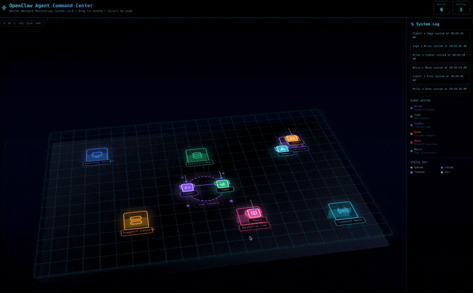

# OpenClaw Agent Command Center

Real-time 3D visualization for monitoring AI agent fleets. Renders autonomous agents as animated robots in an isometric cyberpunk environment with live status tracking, collaboration detection, and an interactive camera system.

Built as the monitoring frontend for [OpenClaw](https://github.com/openclaw) — ships with a fully functional demo mode and a pluggable data provider architecture for connecting to live agent backends via WebSocket.


[**Live Demo**](https://jamjahal.github.io/openclaw_command_center/) · [Report Bug](https://github.com/jamjahal/openclaw_command_center/issues) · [Request Feature](https://github.com/jamjahal/openclaw_command_center/issues)

---



---

## Features

- **3D Isometric Room** — CSS 3D transforms render a full environment with layered floors, animated grid, and circuit overlays at 60fps
- **6 Autonomous Agents** — Each robot has a distinct role, color, and icon with state-driven animations (walking, thinking, waving, collaborating)
- **Interactive Camera** — Drag-to-rotate and scroll-to-zoom with spring physics (constrained X-axis to prevent disorientation)
- **Collision-Aware Movement** — Agents navigate between workstations with 8-point collision avoidance and room boundary clamping
- **Sync Chamber** — Visual collaboration zone with animated connection lines when agents pair up
- **Activity Feed** — Real-time system log, agent roster with pulsing status indicators, and color-coded status key
- **Provider Architecture** — Clean separation between data layer and rendering; swap between demo and live backends with a single env var

## Quick Start

```bash
git clone https://github.com/jamjahal/openclaw_command_center.git
cd openclaw_command_center/openclaw-viewer
npm install
npm run dev
```

Open `http://localhost:5173` — the demo runs immediately with no configuration.

## Configuration

Copy the example environment file and adjust as needed:

```bash
cp .env.example .env
```

| Variable | Default | Description |
|---|---|---|
| `VITE_PROVIDER_MODE` | `demo` | `demo` for mock data, `live` for WebSocket connection |
| `VITE_WS_URL` | `ws://localhost:8080/agents` | WebSocket endpoint (only used when mode is `live`) |

## Architecture

```
openclaw-viewer/src/
├── App.jsx                     # Entry point
├── AgentRoom3D.jsx             # Visualization layer (camera, 3D scene, UI)
└── providers/
    ├── index.js                # Barrel exports
    ├── types.js                # Shared types, room constants, agent/workstation defaults
    ├── useMockProvider.js      # Demo mode — randomized movement & collaboration
    └── useLiveProvider.js      # Live mode — WebSocket with auto-reconnect
```

The visualization consumes a single `ProviderState` shape regardless of source:

```js
{
  agents,         // AgentState[] — positions, status, tasks, trails
  collabPairs,    // CollabPair[] — active collaboration connections
  activityLog,    // string[]     — recent activity messages
  workstations,   // WorkstationDef[] — room layout
  mode,           // "demo" | "live"
  connected       // boolean — data source connectivity
}
```

Both providers return this exact shape. The rendering layer has zero knowledge of which provider is active.

## Connecting to a Live Backend

The live provider expects a WebSocket endpoint that sends JSON messages. Six message types are supported:

| Type | Purpose | Required Fields |
|---|---|---|
| `AGENT_UPDATE` | Agent changed state | `agent.id`, `agent.status`, `agent.currentTask` |
| `COLLABORATION_START` | Two agents begin syncing | `agent1Id`, `agent2Id` |
| `COLLABORATION_END` | Collaboration finished | `agent1Id`, `agent2Id` |
| `LOG` | Activity log entry | `message` |
| `AGENT_REGISTER` | New agent comes online | `agent.id`, `agent.name`, `agent.role`, `agent.color`, `agent.icon` |
| `AGENT_DEREGISTER` | Agent goes offline | `agentId` |

Position mapping is automatic — if your backend doesn't send `position` coordinates, agents are assigned to available workstations. The provider handles reconnection with configurable backoff.

See [`openclaw-viewer/src/providers/useLiveProvider.js`](openclaw-viewer/src/providers/useLiveProvider.js) for the full integration guide and message schema.

## Agent States

Each agent operates in one of four states, each driving distinct visual behavior:

| State | Antenna | Body | Animation |
|---|---|---|---|
| **Idle** | Gray | Subtle hover | None |
| **Working** | Green | Glow aura | Legs walk, moves to workstation |
| **Thinking** | Purple | Pulsing antenna | Antenna extends, light scales |
| **Collaborating** | Blue | Glow aura | Arms wave, head bobs, connection line drawn |

## Tech Stack

| Layer | Technology | Purpose |
|---|---|---|
| UI Framework | React 19 | Component architecture and state management |
| Animation | Framer Motion 12 | Spring physics, motion values, declarative animations |
| Styling | Tailwind CSS 4 | Utility-first CSS with Vite plugin |
| Icons | Lucide React | Consistent icon system for agents and workstations |
| Build | Vite 7 | Dev server with HMR, production builds |
| 3D Rendering | CSS 3D Transforms | Hardware-accelerated isometric scene (no WebGL dependency) |

## Performance

The visualization targets 60fps through several deliberate choices:

- **CSS 3D transforms only** — all spatial rendering is GPU-composited, no JavaScript layout computation
- **Spring-based camera** — `useMotionValue` and `useSpring` update transforms without triggering React re-renders
- **Transform-only animations** — no layout thrashing; `will-change: transform` on animated elements
- **Ref-based position tracking** — agent positions stored in refs to avoid unnecessary render cycles
- **Conditional rendering** — trails, glow effects, and collaboration lines only mount when their state is active

## Scripts

All commands run from `openclaw-viewer/`:

```bash
npm run dev       # Start dev server with HMR
npm run build     # Production build to dist/
npm run preview   # Preview production build locally
npm run lint      # Run ESLint
npm run deploy    # Build and deploy to GitHub Pages
```

## Deployment

### Vercel (recommended)

1. Import the repo at [vercel.com/new](https://vercel.com/new)
2. Set **Root Directory** to `openclaw-viewer`
3. Vercel auto-detects Vite — no other settings needed
4. Click **Deploy**

SPA routing is handled by the included `vercel.json`.

### GitHub Pages

```bash
cd openclaw-viewer
npm install -D gh-pages   # first time only
npm run deploy
```

This builds the app with the correct base path and publishes to the `gh-pages` branch. Enable GitHub Pages in your repo settings (Settings > Pages > Source: `gh-pages` branch) and your live demo will be available at `https://jamjahal.github.io/openclaw_command_center/`.

If you're using a custom domain or deploying elsewhere, set `VITE_BASE_PATH=/` in your environment before building.

## License

MIT
